# 脚本版本全量数据流图

## 1. 范围、版本与阅读方式

本图以 `src/agent.sh` 的实际源码为准。基准提交：视觉消息编码内联化提交（`feat/bash-native-vision` 分支）。

- 主脚本共 **108 个唯一函数、112 处函数定义**。其中 `util_body_convert` 与 `sse_convert` 各有三种条件定义；`sse_parse` 也在配置函数内部定义。它们不能被仅匹配行首的函数扫描遗漏。
- 全局图描述数据跨越的边界；模块图给每个函数真实节点。节点标识固定为 `f_函数名`；跨模块引用仍使用同一标识。
- **实线箭头表示源码调用或条件分派，虚线箭头表示数据传递。** 标签“绑定/生成/回调”表示非普通直接调用。模块图不是时序图，先后顺序以专门时序图和文字为准。
- 图中跨模块出口只画一跳，避免把所有辅助调用挤入总览。函数表逐项给出输入、输出、副作用和定义行号。这里的覆盖率只指函数节点，不代表穷尽每条语句或所有运行时路径。

## 2. 全局数据边界

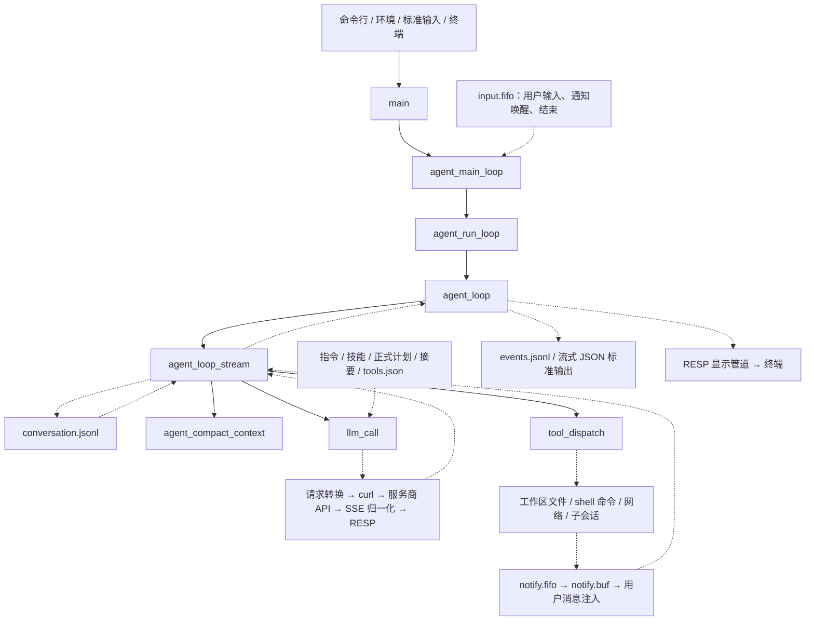

## 3. 主循环的真实顺序、错误与重试

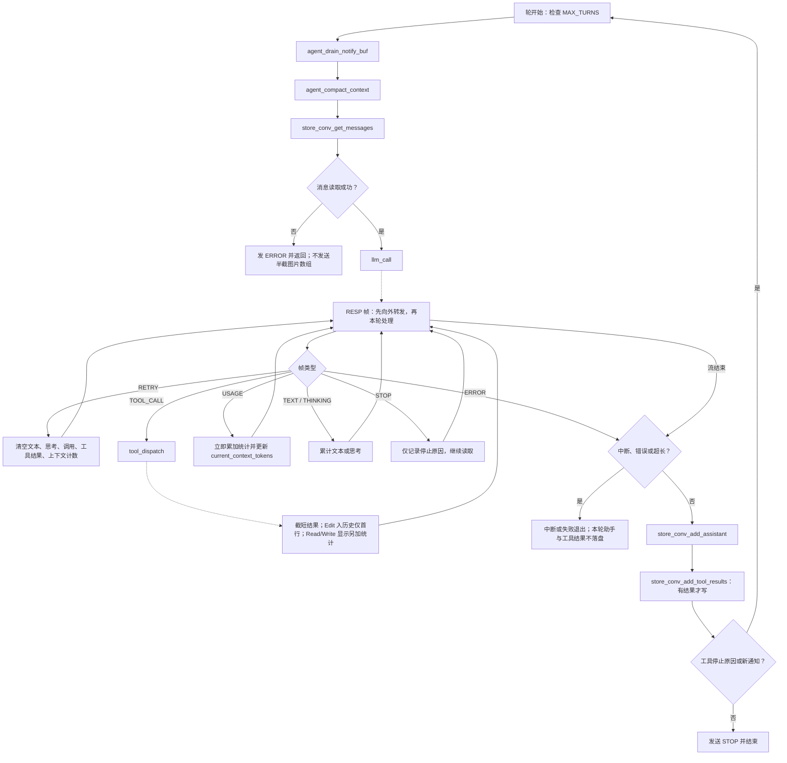

源码依据：`src/agent.sh:1423–1552`。注意工具是在响应读取中**立即执行**，不是完整响应成功后才执行；重试清空内存累计不撤销已发生的文件、命令或网络副作用。用量统计在收到 `USAGE` 时更新，早于助手消息落盘。到达最大轮数后会发错误；本图不将其视为自动成功。

## 4. 函数模块图

以下每个模块图先定义本模块全部函数，再定义必要的跨图引用。独立节点不强造调用关系，详见入口与未调用核对。

### 图 M01：基础协议与序列化

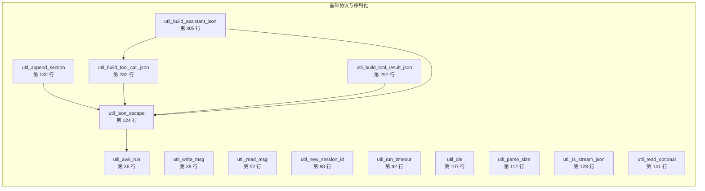

### 图 M02：启动与配置

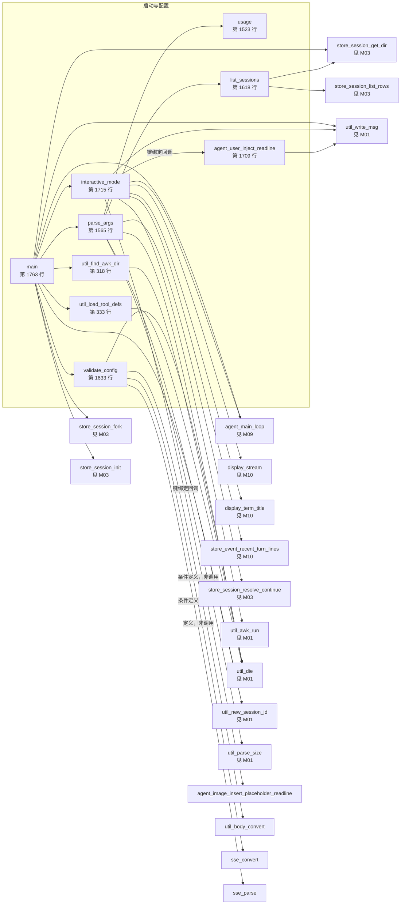

### 图 M03：会话与持久化

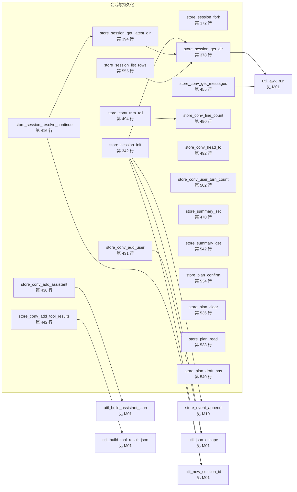

### 图 M04：提示词与技能

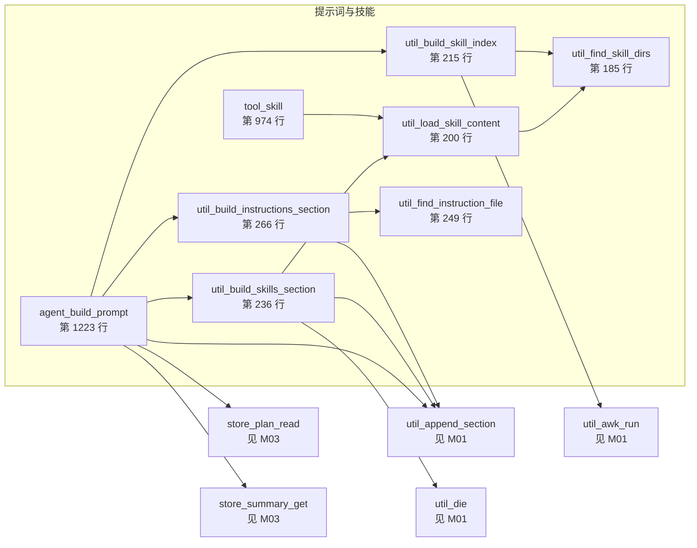

### 图 M05：视觉附件

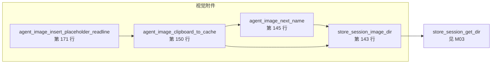

### 图 M06：请求与压缩

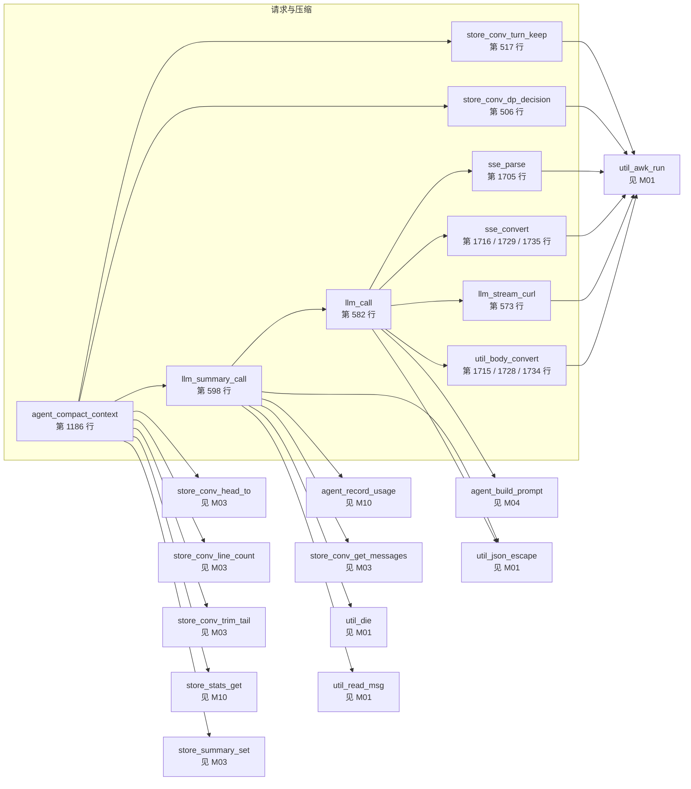

### 图 M07：工具分派与文件操作

```mermaid
flowchart LR
  subgraph mod_7["工具分派与文件操作"]
    f_tool_dispatch["tool_dispatch<br/>第 615 行"]
    f_tool_param_keys["tool_param_keys<br/>第 636 行"]
    f_tool_args_from_msg["tool_args_from_msg<br/>第 651 行"]
    f_tool_call_summary["tool_call_summary<br/>第 672 行"]
    f_tool_format_result["tool_format_result<br/>第 705 行"]
    f_tool_file_summary["tool_file_summary<br/>第 721 行"]
    f_tool_emit_result["tool_emit_result<br/>第 734 行"]
    f_tool_read["tool_read<br/>第 879 行"]
    f_tool_write["tool_write<br/>第 891 行"]
    f_tool_edit["tool_edit<br/>第 899 行"]
    f_tool_bash["tool_bash<br/>第 921 行"]
    f_tool_glob["tool_glob<br/>第 953 行"]
    f_tool_grep["tool_grep<br/>第 962 行"]
    f_tool_plan_confirm["tool_plan_confirm<br/>第 983 行"]
    f_tool_plan_clear["tool_plan_clear<br/>第 995 行"]
    f_tool_sub_agent["tool_sub_agent<br/>第 1003 行"]
  end
  f_agent_compact_context["agent_compact_context<br/>见 M06"]
  f_agent_loop["agent_loop<br/>见 M09"]
  f_store_event_append["store_event_append<br/>见 M10"]
  f_store_plan_clear["store_plan_clear<br/>见 M03"]
  f_store_plan_confirm["store_plan_confirm<br/>见 M03"]
  f_store_plan_draft_has["store_plan_draft_has<br/>见 M03"]
  f_store_session_fork["store_session_fork<br/>见 M03"]
  f_store_session_get_dir["store_session_get_dir<br/>见 M03"]
  f_store_session_init["store_session_init<br/>见 M03"]
  f_store_sub_send_result["store_sub_send_result<br/>见 M09"]
  f_tool_bash_mode_guard["tool_bash_mode_guard<br/>见 M08"]
  f_tool_native_file_mode_guard["tool_native_file_mode_guard<br/>见 M08"]
  f_tool_skill["tool_skill<br/>见 M04"]
  f_util_awk_run["util_awk_run<br/>见 M01"]
  f_util_json_escape["util_json_escape<br/>见 M01"]
  f_util_load_tool_defs["util_load_tool_defs<br/>见 M02"]
  f_util_new_session_id["util_new_session_id<br/>见 M01"]
  f_util_run_timeout["util_run_timeout<br/>见 M01"]
  f_util_write_msg["util_write_msg<br/>见 M01"]
  f_tool_dispatch --> f_tool_native_file_mode_guard
  f_tool_dispatch --> f_tool_read
  f_tool_dispatch --> f_tool_write
  f_tool_dispatch --> f_tool_edit
  f_tool_dispatch --> f_tool_bash
  f_tool_dispatch --> f_tool_glob
  f_tool_dispatch --> f_tool_grep
  f_tool_dispatch --> f_tool_plan_confirm
  f_tool_dispatch --> f_tool_plan_clear
  f_tool_dispatch --> f_tool_skill
  f_tool_dispatch --> f_tool_sub_agent
  f_tool_args_from_msg --> f_tool_param_keys
  f_tool_file_summary --> f_util_awk_run
  f_tool_emit_result --> f_util_write_msg
  f_tool_edit --> f_util_json_escape
  f_tool_edit --> f_util_awk_run
  f_tool_bash --> f_tool_bash_mode_guard
  f_tool_bash --> f_util_new_session_id
  f_tool_bash --> f_util_write_msg
  f_tool_bash --> f_util_run_timeout
  f_tool_bash --> f_util_awk_run
  f_tool_plan_confirm --> f_store_plan_draft_has
  f_tool_plan_confirm --> f_agent_compact_context
  f_tool_plan_confirm --> f_store_plan_confirm
  f_tool_plan_clear --> f_agent_compact_context
  f_tool_plan_clear --> f_store_plan_clear
  f_tool_sub_agent --> f_util_new_session_id
  f_tool_sub_agent --> f_store_event_append
  f_tool_sub_agent --> f_util_json_escape
  f_tool_sub_agent --> f_store_session_fork
  f_tool_sub_agent --> f_store_session_get_dir
  f_tool_sub_agent --> f_store_session_init
  f_tool_sub_agent --> f_util_load_tool_defs
  f_tool_sub_agent --> f_agent_loop
  f_tool_sub_agent --> f_store_sub_send_result
```

### 图 M08：工具权限分类

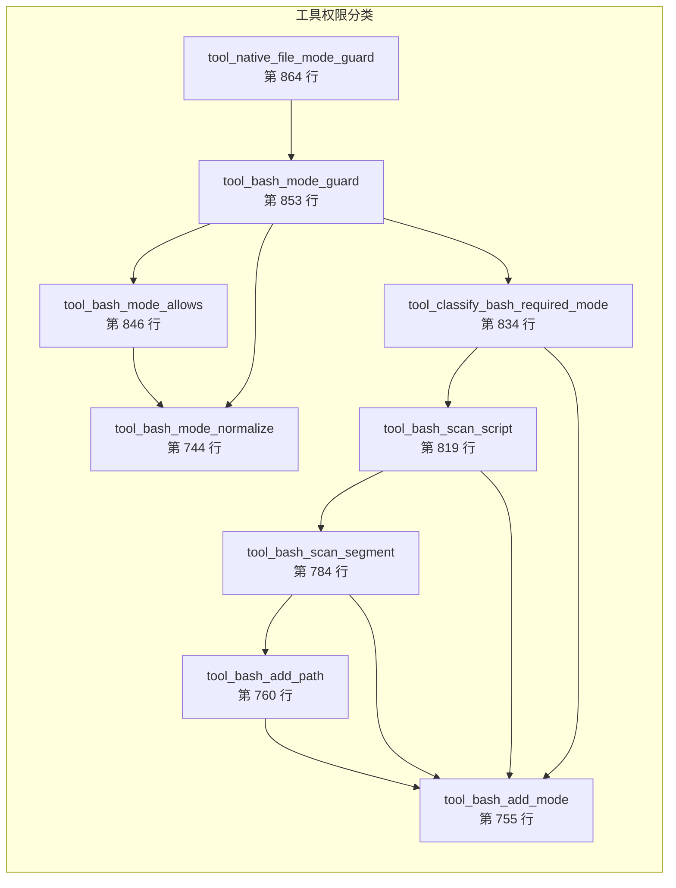

### 图 M09：主循环与异步通知

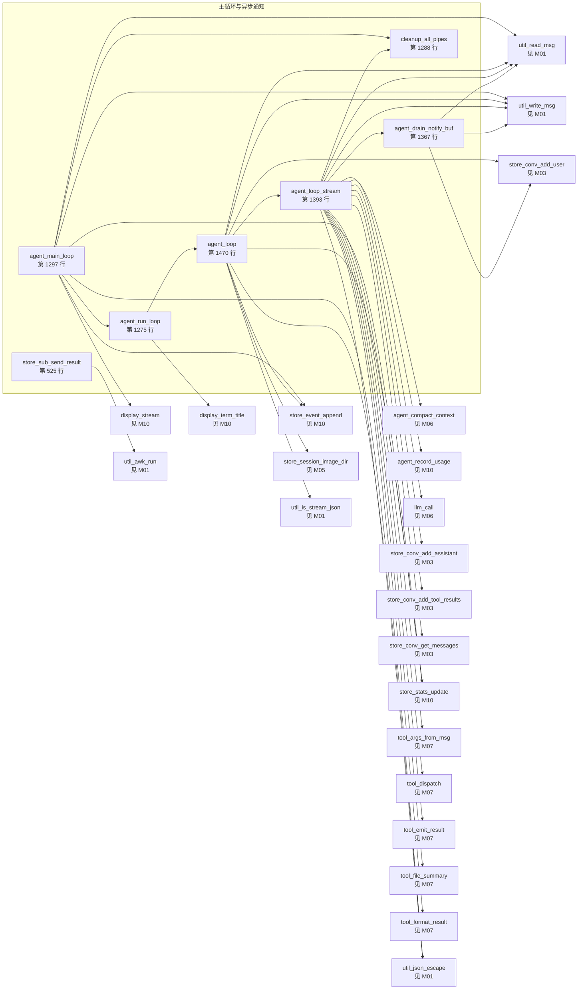

### 图 M10：事件统计与显示

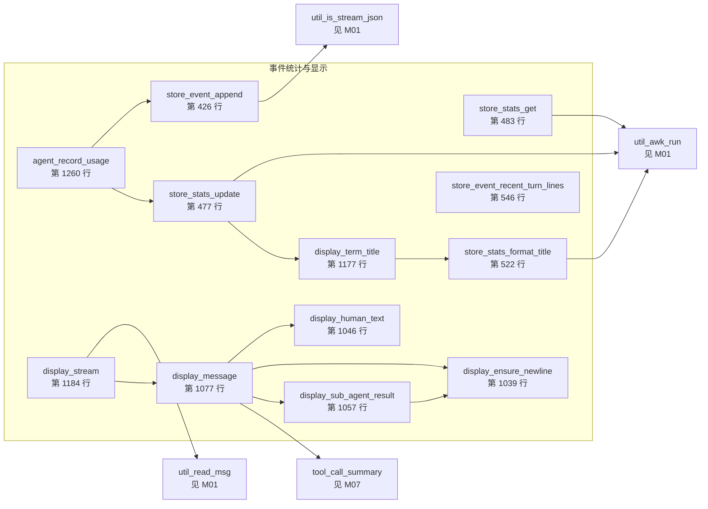

## 5. 完整函数覆盖表

定义位置均相对于仓库根；同名函数的所有条件定义分别列出。输入包括参数、全局变量和标准输入，输出包括退出状态、标准输出和更新的变量。

| 函数 | 源码定义 | 所在图 | 输入 | 输出 | 副作用 |
|---|---|---|---|---|---|
| `util_awk_run` | [`src/agent.sh:36`](../src/agent.sh#L36) | M01 | 参数与标准输入 | 解析结果与退出码 | 固定解析进程区域设置 |
| `util_write_msg` | [`src/agent.sh:38`](../src/agent.sh#L38) | M01 | 任意字段 | 带字节长度的 RESP 帧 | 写标准输出 |
| `util_read_msg` | [`src/agent.sh:52`](../src/agent.sh#L52) | M01 | 标准输入 RESP | REPLY_MESSAGE 数组与状态 | 暂改区域设置并恢复 |
| `util_new_session_id` | [`src/agent.sh:88`](../src/agent.sh#L88) | M01 | 时间与随机数 | 会话标识 | 调用日期命令 |
| `util_run_timeout` | [`src/agent.sh:92`](../src/agent.sh#L92) | M01 | 秒数与命令 | 合并输出及退出码 | 启动命令与超时监控，可能发送终止信号 |
| `util_die` | [`src/agent.sh:107`](../src/agent.sh#L107) | M01 | 错误文本 | 红色错误 | 写标准错误并退出当前 shell |
| `util_parse_size` | [`src/agent.sh:112`](../src/agent.sh#L112) | M01 | 数值及 k/m/g 后缀 | 十进制字节数或失败 | 无持久写入 |
| `util_json_escape` | [`src/agent.sh:124`](../src/agent.sh#L124) | M01 | 字符串 | JSON 转义文本 | 启动解析器 |
| `util_is_stream_json` | [`src/agent.sh:128`](../src/agent.sh#L128) | M01 | OUTPUT_FORMAT | 条件退出码 | 无 |
| `util_append_section` | [`src/agent.sh:130`](../src/agent.sh#L130) | M01 | 输出变量名、标签、内容、可选名称 | 更新指定变量 | 空内容不追加，名称采用 JSON 转义 |
| `util_read_optional` | [`src/agent.sh:141`](../src/agent.sh#L141) | M01 | 文件路径 | 非空文件内容 | 读取文件，主脚本未发现调用 |
| `store_session_image_dir` | [`src/agent.sh:143`](../src/agent.sh#L143) | M05 | 项目路径与会话标识 | images 路径 | 无持久写入 |
| `agent_image_next_name` | [`src/agent.sh:145`](../src/agent.sh#L145) | M05 | 图片目录 | 现有数量加一的文件名 | 列目录，不是取最大编号 |
| `agent_image_clipboard_to_cache` | [`src/agent.sh:150`](../src/agent.sh#L150) | M05 | 剪贴板 | 图片文件名或失败 | 依次尝试三种剪贴板命令，可选压缩，临时文件移动及清理 |
| `agent_image_insert_placeholder_readline` | [`src/agent.sh:171`](../src/agent.sh#L171) | M05 | 编辑行与光标 | 修改后的编辑行和光标 | 缓存图片并插入占位符 |
| `util_find_skill_dirs` | [`src/agent.sh:185`](../src/agent.sh#L185) | M04 | 工作目录与主目录 | 按优先级排列的技能目录 | 检查目录 |
| `util_load_skill_content` | [`src/agent.sh:200`](../src/agent.sh#L200) | M04 | 技能名称 | 目录提示及替换变量后的技能正文 | 依序寻找 SKILL.md |
| `util_build_skill_index` | [`src/agent.sh:215`](../src/agent.sh#L215) | M04 | 技能目录 | 去重后的技能摘要索引 | 读取每个技能文件 |
| `util_build_skills_section` | [`src/agent.sh:236`](../src/agent.sh#L236) | M04 | SKILL_NAMES | 选中技能标签集合 | 缺失技能时报错退出 |
| `util_find_instruction_file` | [`src/agent.sh:249`](../src/agent.sh#L249) | M04 | 目录 | 第一个匹配的指令文件路径 | 按四种固定文件名检查 |
| `util_build_instructions_section` | [`src/agent.sh:266`](../src/agent.sh#L266) | M04 | 全局及项目目录 | 指令标签集合 | 读取指令并标记 global/project |
| `util_build_tool_call_json` | [`src/agent.sh:282`](../src/agent.sh#L282) | M01 | 名称、标识、输入、类型 | 工具调用 JSON | 无持久写入 |
| `util_build_tool_result_json` | [`src/agent.sh:297`](../src/agent.sh#L297) | M01 | 标识、已转义结果、类型 | 结果 JSON | 不再次转义结果正文 |
| `util_build_assistant_json` | [`src/agent.sh:305`](../src/agent.sh#L305) | M01 | 文本、思考、制表符分隔调用 | 内容数组 JSON | 始终包含思考与文本块 |
| `util_find_awk_dir` | [`src/agent.sh:318`](../src/agent.sh#L318) | M02 | AWK_DIR 或脚本目录 | AWK_DIR | 目录无效时退出 |
| `util_load_tool_defs` | [`src/agent.sh:333`](../src/agent.sh#L333) | M02 | 脚本相邻 tools.json | TOOL_DEF_JSON | 读取定义，缺失退出 |
| `store_session_init` | [`src/agent.sh:342`](../src/agent.sh#L342) | M03 | SESSION_ID、项目目录 | 各存储路径全局变量 | 创建文件与 FIFO，活跃任务计数重置为零 |
| `store_session_fork` | [`src/agent.sh:372`](../src/agent.sh#L372) | M03 | 父目录、子目录 | 退出状态 | 仅复制对话、归档、摘要、正式计划，复制失败被忽略 |
| `store_session_get_dir` | [`src/agent.sh:378`](../src/agent.sh#L378) | M03 | 工作目录、存储根 | 项目目录路径 | 物理路径规范化及字符替换 |
| `store_session_get_latest_dir` | [`src/agent.sh:394`](../src/agent.sh#L394) | M03 | 项目目录 | 最近非子代理会话名 | 优先比较事件文件时间 |
| `store_session_resolve_continue` | [`src/agent.sh:416`](../src/agent.sh#L416) | M03 | 最近会话 | SESSION_ID | 找不到则生成新标识 |
| `store_event_append` | [`src/agent.sh:426`](../src/agent.sh#L426) | M10 | JSON 事件 | 流式模式同时输出事件行 | 追加 events.jsonl |
| `store_conv_add_user` | [`src/agent.sh:431`](../src/agent.sh#L431) | M03 | 文本 | 无正文返回 | 追加用户 JSONL |
| `store_conv_add_assistant` | [`src/agent.sh:436`](../src/agent.sh#L436) | M03 | 文本、思考、调用 | 无正文返回 | 追加助手 JSONL |
| `store_conv_add_tool_results` | [`src/agent.sh:442`](../src/agent.sh#L442) | M03 | 标识与已转义结果列表 | 无正文返回 | 追加用户角色结果数组 |
| `store_conv_get_messages` | [`src/agent.sh:455`](../src/agent.sh#L455) | M03 | JSONL 文件路径（缺省会话文件）、视觉开关 | 消息 JSON 数组或失败 | 关闭时逐行拼接；开启时内嵌单遍 awk 展开附件；compact 摘要直接传被丢弃消息的临时文件 |
| `store_summary_set` | [`src/agent.sh:470`](../src/agent.sh#L470) | M03 | 非空摘要 | 退出状态 | 覆盖摘要文件，空内容不写 |
| `store_stats_update` | [`src/agent.sh:477`](../src/agent.sh#L477) | M10 | 键值覆盖或累加参数 | 标题输出 | 解析器更新 stats.json |
| `store_stats_get` | [`src/agent.sh:483`](../src/agent.sh#L483) | M10 | 统计键 | 数值 | 读取 stats.json |
| `store_conv_line_count` | [`src/agent.sh:490`](../src/agent.sh#L490) | M03 | CONV_FILE | 行数 | 读对话文件 |
| `store_conv_head_to` | [`src/agent.sh:492`](../src/agent.sh#L492) | M03 | 行数、目标文件 | 退出状态 | 对话头部写入目标文件 |
| `store_conv_trim_tail` | [`src/agent.sh:494`](../src/agent.sh#L494) | M03 | 保留行数 | 退出状态 | 先归档丢弃头部，再用尾部临时文件替换对话 |
| `store_conv_user_turn_count` | [`src/agent.sh:502`](../src/agent.sh#L502) | M03 | CONV_FILE | 字符串用户消息计数 | 主脚本未发现调用 |
| `store_conv_dp_decision` | [`src/agent.sh:506`](../src/agent.sh#L506) | M06 | 统计与经济参数 | 建议保留行数 | 调用动态规划解析器读取对话 |
| `store_conv_turn_keep` | [`src/agent.sh:517`](../src/agent.sh#L517) | M06 | 保留比例与对话 | 按轮边界的保留行数 | 调用回退解析器 |
| `store_stats_format_title` | [`src/agent.sh:522`](../src/agent.sh#L522) | M10 | 模型与状态 | 终端标题转义序列 | 读取统计 |
| `store_sub_send_result` | [`src/agent.sh:525`](../src/agent.sh#L525) | M09 | 子会话标识、状态、目标 | AGENT_RESULT 帧写目标 | 解析子会话末条助手结果与统计 |
| `store_plan_confirm` | [`src/agent.sh:534`](../src/agent.sh#L534) | M03 | 非空草稿 | 成功或失败 | 移动为正式计划并重新创建空草稿 |
| `store_plan_clear` | [`src/agent.sh:536`](../src/agent.sh#L536) | M03 | 正式计划 | 退出状态 | 清空非空正式计划 |
| `store_plan_read` | [`src/agent.sh:538`](../src/agent.sh#L538) | M03 | 正式计划 | 非空正文 | 读取文件 |
| `store_plan_draft_has` | [`src/agent.sh:540`](../src/agent.sh#L540) | M03 | 草稿路径 | 存在且非空的条件状态 | 无 |
| `store_summary_get` | [`src/agent.sh:542`](../src/agent.sh#L542) | M03 | 摘要文件 | 非空摘要正文 | 读取文件 |
| `store_event_recent_turn_lines` | [`src/agent.sh:546`](../src/agent.sh#L546) | M10 | 轮数及事件文件 | 从选中 user_input 起的事件行 | 用于交互重放 |
| `store_session_list_rows` | [`src/agent.sh:555`](../src/agent.sh#L555) | M03 | 项目目录 | 按时间倒序的制表符行 | 读取各会话元数据与摘要首行 |
| `llm_stream_curl` | [`src/agent.sh:573`](../src/agent.sh#L573) | M06 | 请求标准输入、请求头、API_URL | 过滤后的 SSE | 启动 curl，写入并删除临时进程号文件 |
| `llm_call` | [`src/agent.sh:582`](../src/agent.sh#L582) | M06 | 消息、可选输出上限与思考模式 | 统一 RESP 响应流 | 构建提示词与请求，发起网络调用 |
| `llm_summary_call` | [`src/agent.sh:598`](../src/agent.sh#L598) | M06 | 被丢弃消息临时文件 | 摘要正文 | 摘要指令追加到该文件后经 store_conv_get_messages 构建，复用 llm_call，记录压缩用量 |
| `tool_dispatch` | [`src/agent.sh:615`](../src/agent.sh#L615) | M07 | 名称与位置参数 | 工具输出或错误 | 按工具分支执行，未知名称失败 |
| `tool_param_keys` | [`src/agent.sh:636`](../src/agent.sh#L636) | M07 | 工具名称 | 参数键顺序 | 无 |
| `tool_args_from_msg` | [`src/agent.sh:651`](../src/agent.sh#L651) | M07 | 名称及 REPLY_MESSAGE | _TOOL_ARGS 数组 | 缺失键填空串 |
| `tool_call_summary` | [`src/agent.sh:672`](../src/agent.sh#L672) | M07 | 名称及键值 | 短调用描述 | 命令折行并限制长度 |
| `tool_format_result` | [`src/agent.sh:705`](../src/agent.sh#L705) | M07 | 输出文本 | 截短或原始文本 | 保留头尾，实际使用 shell 字符长度 |
| `tool_file_summary` | [`src/agent.sh:721`](../src/agent.sh#L721) | M07 | 类型、路径、范围 | 文件行数字节数摘要 | 读取文件统计 |
| `tool_emit_result` | [`src/agent.sh:734`](../src/agent.sh#L734) | M07 | 标识、名称、输出及原消息 | TOOL_RESULT 帧 | 透传 checklist 与 summary |
| `tool_bash_mode_normalize` | [`src/agent.sh:744`](../src/agent.sh#L744) | M08 | 四位八进制字符串 | 规范值或 0000 | 无 |
| `tool_bash_add_mode` | [`src/agent.sh:755`](../src/agent.sh#L755) | M08 | 范围位与权限位 | TOOL_BASH_REQUIRED_MASK | 按位合并 |
| `tool_bash_add_path` | [`src/agent.sh:760`](../src/agent.sh#L760) | M08 | 路径与权限 | 累计权限掩码 | 分类系统、外部、网络、工作区及临时路径 |
| `tool_bash_scan_segment` | [`src/agent.sh:784`](../src/agent.sh#L784) | M08 | 命令片段 | 累计权限掩码 | 启发式检测命令与重定向 |
| `tool_bash_scan_script` | [`src/agent.sh:819`](../src/agent.sh#L819) | M08 | 命令文本 | 累计权限掩码 | 按连接符拆分片段，不是完整 shell 语法解析 |
| `tool_classify_bash_required_mode` | [`src/agent.sh:834`](../src/agent.sh#L834) | M08 | 命令 | 四位所需权限及全局变量 | 小写化、扫描、默认工作区读权限 |
| `tool_bash_mode_allows` | [`src/agent.sh:846`](../src/agent.sh#L846) | M08 | 允许值与所需值 | 位包含条件状态 | 无 |
| `tool_bash_mode_guard` | [`src/agent.sh:853`](../src/agent.sh#L853) | M08 | 命令与允许配置 | 通过或拒绝文本 | 写权限分类全局状态 |
| `tool_native_file_mode_guard` | [`src/agent.sh:864`](../src/agent.sh#L864) | M08 | 工具名称、路径、模式 | 通过或拒绝 | 构造读写探针交给同一权限检查 |
| `tool_read` | [`src/agent.sh:879`](../src/agent.sh#L879) | M07 | 路径、偏移、上限 | 文件行文本或错误 | sed 读取，不添加行号 |
| `tool_write` | [`src/agent.sh:891`](../src/agent.sh#L891) | M07 | 路径、内容 | 写入字节数提示 | 创建父目录并覆盖文件 |
| `tool_edit` | [`src/agent.sh:899`](../src/agent.sh#L899) | M07 | 路径、旧串、新串 | 差异与行数提示或错误 | 解析器生成临时替换结果，非空才覆盖原文件 |
| `tool_bash` | [`src/agent.sh:921`](../src/agent.sh#L921) | M07 | 命令、超时、后台标志 | 同步输出或任务标识 | 安全检查，前台超时，后台通知 |
| `tool_glob` | [`src/agent.sh:953`](../src/agent.sh#L953) | M07 | 模式、路径 | 匹配文件名 | 依赖 rg，忽略其非零退出码 |
| `tool_grep` | [`src/agent.sh:962`](../src/agent.sh#L962) | M07 | 正则、路径、文件筛选、上下文 | 带行号搜索结果 | 依赖 rg，忽略其非零退出码 |
| `tool_skill` | [`src/agent.sh:974`](../src/agent.sh#L974) | M04 | 技能名称 | 技能全文或错误 | 读取技能但不修改 SKILL_NAMES |
| `tool_plan_confirm` | [`src/agent.sh:983`](../src/agent.sh#L983) | M07 | 草稿状态 | 确认文本 | 先压缩后移动草稿 |
| `tool_plan_clear` | [`src/agent.sh:995`](../src/agent.sh#L995) | M07 | 当前计划 | 完成文本 | 先压缩再清空计划 |
| `tool_sub_agent` | [`src/agent.sh:1003`](../src/agent.sh#L1003) | M07 | 提示词、描述、派生标志 | 子会话标识与进程号 | 限制一层，创建隔离会话，后台运行并通知 |
| `display_ensure_newline` | [`src/agent.sh:1039`](../src/agent.sh#L1039) | M10 | 显示末字符 | 必要换行 | 更新显示状态 |
| `display_human_text` | [`src/agent.sh:1046`](../src/agent.sh#L1046) | M10 | 文本 | 终端文本 | 更新末字符 |
| `display_sub_agent_result` | [`src/agent.sh:1057`](../src/agent.sh#L1057) | M10 | 子会话状态、用量、思考、正文 | 完成或失败摘要 | 思考与正文各最多显示 120 字符 |
| `display_message` | [`src/agent.sh:1077`](../src/agent.sh#L1077) | M10 | REPLY_MESSAGE | 人类可读输出 | 按类型着色及维护显示状态，错误写标准错误 |
| `display_term_title` | [`src/agent.sh:1177`](../src/agent.sh#L1177) | M10 | 状态、活跃任务数 | 标题序列 | 活跃任务存在时抑制空闲状态 |
| `display_stream` | [`src/agent.sh:1184`](../src/agent.sh#L1184) | M10 | 标准输入 RESP | 连续终端输出 | 循环读取并显示 |
| `agent_compact_context` | [`src/agent.sh:1186`](../src/agent.sh#L1186) | M06 | 触发原因、统计、对话 | 成功或不压缩状态 | 决策后生成摘要、写摘要、归档裁剪 |
| `agent_build_prompt` | [`src/agent.sh:1223`](../src/agent.sh#L1223) | M04 | 环境、规则、指令、技能、计划、摘要 | 拼接后的系统提示词 | 读取动态文件，不包含草稿正文 |
| `agent_record_usage` | [`src/agent.sh:1260`](../src/agent.sh#L1260) | M10 | REPLY_MESSAGE 用量与计数键 | 四类 token 总和 | 按开关写用量事件，并累加统计 |
| `agent_run_loop` | [`src/agent.sh:1275`](../src/agent.sh#L1275) | M09 | 输入与轮类型 | 末尾条件语句状态，不透传内部循环退出码 | 运行后更新空闲标题与交互提示 |
| `cleanup_all_pipes` | [`src/agent.sh:1288`](../src/agent.sh#L1288) | M09 | 已打开描述符 | 无 | 按 4、5、3、6、7、8 顺序关闭 |
| `agent_main_loop` | [`src/agent.sh:1297`](../src/agent.sh#L1297) | M09 | 输入 FIFO 与通知 FIFO | 会话运行 | 创建显示及通知进程，分派输入，结束后清理 |
| `agent_drain_notify_buf` | [`src/agent.sh:1367`](../src/agent.sh#L1367) | M09 | 通知缓冲 | 显示帧及有无注入状态 | 先移动缓冲快照，再追加合并用户消息 |
| `agent_loop_stream` | [`src/agent.sh:1393`](../src/agent.sh#L1393) | M09 | 输入与持久对话 | RESP 事件流 | 每轮排空通知、压缩、请求、立即执行工具、持久化 |
| `agent_loop` | [`src/agent.sh:1470`](../src/agent.sh#L1470) | M09 | 输入、轮类型 | 成功或失败及显示事件 | 记录输入、附件映射、统计、事件，信号中断处理 |
| `usage` | [`src/agent.sh:1523`](../src/agent.sh#L1523) | M02 | 无 | 帮助文本 | 退出当前 shell |
| `parse_args` | [`src/agent.sh:1565`](../src/agent.sh#L1565) | M02 | 参数数组 | 配置全局变量 | 帮助或列表分支提前退出 |
| `list_sessions` | [`src/agent.sh:1618`](../src/agent.sh#L1618) | M02 | 项目目录 | 会话列表 | 读取目录及摘要 |
| `validate_config` | [`src/agent.sh:1633`](../src/agent.sh#L1633) | M02 | 配置与服务商环境变量 | 模型、地址、请求头 | 动态定义三个协议函数 |
| `util_body_convert` | [`src/agent.sh:1678`](../src/agent.sh#L1678)、[`src/agent.sh:1724`](../src/agent.sh#L1724)、[`src/agent.sh:1730`](../src/agent.sh#L1730) | M06 | 统一请求、视觉开关 | 服务商请求 JSON | 配置阶段按服务商重定义 |
| `sse_convert` | [`src/agent.sh:1679`](../src/agent.sh#L1679)、[`src/agent.sh:1725`](../src/agent.sh#L1725)、[`src/agent.sh:1731`](../src/agent.sh#L1731) | M06 | 服务商 SSE | Claude 形式 SSE | 配置阶段按服务商重定义 |
| `sse_parse` | [`src/agent.sh:1705`](../src/agent.sh#L1705) | M06 | 统一 SSE | RESP 事件 | 统一解析文本、工具、停止、用量 |
| `agent_user_inject_readline` | [`src/agent.sh:1709`](../src/agent.sh#L1709) | M02 | READLINE_LINE | USER_NOTIFY 帧 | 写通知描述符并清空编辑行 |
| `interactive_mode` | [`src/agent.sh:1715`](../src/agent.sh#L1715) | M02 | 历史、终端输入、旧事件 | USER_INPUT 或 SESSION_END 帧 | 历史追加、键绑定、后台输入进程 |
| `main` | [`src/agent.sh:1763`](../src/agent.sh#L1763) | M02 | 命令行及标准输入 | 会话执行结果 | 初始化并选择交互或单次模式 |

## 6. 三协议、视觉与外部进程

```mermaid
flowchart TD
  d_jsonl["JSONL：文本占位符与 attached-images 路径映射"] -.-> f_store_conv_get_messages["store_conv_get_messages"]
  f_store_conv_get_messages --> v_switch{"AGENT_VISION"}
  v_switch -->|off| v_old["原逐行循环：读取全文并拼消息数组；不读取图片"]
  v_switch -->|on| v_awk["json.awk + vision_body.awk：单遍读消息<br/>（内嵌于 store_conv_get_messages）"]
  v_awk -->|遇图执行内联固定命令| v_enc["bash -c 'set -o pipefail; base64 < \"$1\" | tr -d \"\\r\\n\"'"]
  v_enc --> v_ok{"base64 退出码为 0 且有数据？<br/>（.png 后缀已由映射行正则限定）"}
  v_ok -->|否| v_err["返回失败；主循环拒绝发送"]
  v_ok -->|是| v_b64["base64 数据回填消息"]
  v_b64 -.-> v_awk
  v_old -.-> f_llm_call["llm_call：统一请求"]
  v_awk -.-> f_llm_call
  f_llm_call --> f_util_body_convert["util_body_convert"]
  f_util_body_convert -.-> p_c["Claude：cat 直通"]
  f_util_body_convert -.-> p_o["OpenAI：transport_openai_body.awk"]
  f_util_body_convert -.-> p_r["Responses：transport_responses_body.awk"]
  p_c -.-> f_llm_stream_curl["llm_stream_curl"]
  p_o -.-> f_llm_stream_curl
  p_r -.-> f_llm_stream_curl
  f_llm_stream_curl -.-> p_http["curl HTTP 头与正文 → http_stream.awk"]
  p_http -.-> f_sse_convert["sse_convert：直通或对应服务商 SSE 转换"]
  f_sse_convert -.-> f_sse_parse["sse_parse：统一 claude_sse.awk"]
  f_sse_parse -.-> p_resp["RESP：TEXT / THINKING / TOOL_CALL / USAGE / RETRY / STOP / ERROR"]
```

请求实际字段顺序（`src/agent.sh:612–625`）为：

`max_tokens → messages → model → output_config（有思考时）→ stream → system（非空时）→ thinking（有思考时）→ tools（非空时）`。

这是当前主脚本的实现，**不同于项目指导文件描述的目标顺序**。本文不改代码，也未核对其余三个运行时。摘要复用此路径，仅传入不同消息并关闭思考，不能据此声称实际请求前缀缓存一定命中。

网络边界：`curl` 从标准输入读取请求，带服务商请求头发往 `API_URL`；连接超时 5 秒、低速 60 秒、重试次数 2、重试延迟 1 秒、重试窗口 20 秒。标准错误被合入 HTTP 流，`http_stream.awk` 再区分错误。没有在此层证明重试对外部工具副作用具备幂等性。

视觉外部命令：`osascript → wl-paste → xclip` 是失败回退链，不是三者同时运行；`oxipng` 可用时尝试压缩。图片编号取文件数加一，存在编号空洞时不保证不重名。会话派生不复制 `images`；已有历史路径可能仍指向父会话图片，校验边界是当前项目的物理会话存储根目录下的会话目录，不是项目工作区根目录，也不限于当前会话。

## 7. 压缩与计划：实际写入顺序和缺口

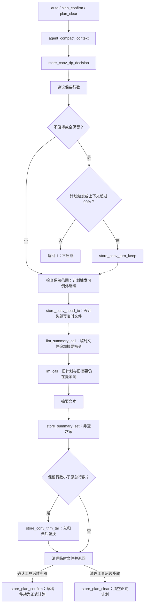

源码依据：`src/agent.sh:628–641、1012–1028、1215–1249`。

- 正确存在的顺序：先请求摘要，再写摘要，再按条件裁剪；确认或清理计划时，计划文件变化在压缩之后。草稿正文不进入提示词。
- **摘要使用的是待丢弃头部加指令，不是完整旧对话。** 虽然磁盘尚未裁剪，但不能因此说摘要请求携带完整历史。
- **失败守卫缺口：** `summary_response=$(llm_summary_call ...)` 后未检查退出码。空摘要会由 `util_die` 终止命令替换的子 shell，但外层没有 `set -e`，仍可能继续裁剪。`store_summary_set` 的空文本守卫只能阻止写空摘要，不能阻止后续裁剪。
- **摘要重试缺口：** 摘要读取循环没有 `RETRY` 分支，不像正常主循环那样清空文本累计；`ERROR` 仅保存最近错误信息，最终只以文本是否为空决定是否报错。
- **用量守卫缺口：** `agent_record_usage` 没有 token 大于零的条件守卫，收到全零 `USAGE` 也会计数。摘要读取时就记用量，故不能保证失败摘要不写用量。
- 计划工具也没有检查压缩返回码才更新计划。这些是源码现状，不是本文建议的行为。

## 8. 进程、描述符与通知帧

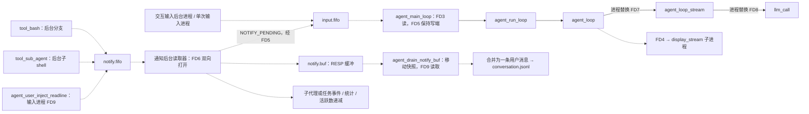

| 描述符 | 所属上下文与用途 |
|---|---|
| 3 / 5 | 主循环读取输入 FIFO / 保持写端并发送唤醒与结束 |
| 4 | 主循环至显示子进程的 RESP 管道 |
| 6 | 通知后台进程以读写方式打开通知 FIFO，避免写端结束导致 EOF |
| 7 | `agent_loop` 读取 `agent_loop_stream` |
| 8 | `agent_loop_stream` 读取 `llm_call` |
| 9 | 不同进程各自复用：交互注入通知、通知快照读取、curl 输出读取；不是同一个全局通道 |

通知帧的数据顺序尤其需要区分：

- 子代理写入 FIFO：`AGENT_RESULT, sid, status, thinking, text, in, out, cache_read, cache_creation, requests`。
- 通知读取器写入缓冲：`AGENT_RESULT, sid, status, in, out, thinking, text`。用量已在此时计入父会话。
- 后台命令：`ASYNC_TASK_RESULT, task_id, exit_code, output`。
- 用户注入：`USER_NOTIFY, text`，不递减活跃任务数。
- `notify.buf` 的源码注释曾写 XML，但实际是 `util_write_msg` 输出的 RESP 帧。

子代理只允许深度小于 1 的会话启动。子 shell 初始化独立会话、关闭继承描述符并静默输出，正常及退出陷阱都尝试发送结果，`_done` 避免正常路径重复发送。父进程在非交互输入已处理、活跃计数不大于零且缓冲为空时发送结束。

后台命令分支直接执行 `bash -lc`，**没有使用传入的 timeout**；前台分支才使用超时包装。活跃计数与统计文件使用普通读改写；未见跨进程锁，不能声称并发更新原子安全。缓冲移动快照也不构成对所有并发写入时序的证明。

## 9. 数据字典与文件读写表

| 数据 | 生产者 | 消费者 | 格式与含义 |
|---|---|---|---|
| `REPLY_MESSAGE` | `util_read_msg` | 显示、工具参数解析、主循环、摘要、通知读取器 | RESP 字段数组，第零项为消息类型；同名变量在子进程中各自独立 |
| `TOOL_DEF_JSON` | `util_load_tool_defs` | `llm_call` | 工具定义数组，原文读取 |
| `text / thinking / tool_calls` | `agent_loop_stream` | 对话写入函数 | 当前请求累计；调用列表用制表符与换行分隔 |
| `tool_conv_results` | 工具调用分支 | `store_conv_add_tool_results` | 标识加已经 JSON 转义的结果；不是原始任意字节流 |
| `_TOOL_ARGS` | `tool_args_from_msg` | `tool_dispatch` | 根据工具键表排列的位置参数 |
| `HEADER_ARGS / API_URL` | `validate_config` | `llm_stream_curl` | 认证及网络配置；不得在文档或日志示例中填入真实密钥 |
| `TOOL_BASH_REQUIRED_MASK / MODE` | 权限扫描函数 | 权限守卫 | 系统、外部、网络、工作区四组八进制读写执行位；启发式分类，不是隔离沙箱 |
| `DISPLAY_LAST_CHAR / PREV_WAS_THINKING` | 显示函数 | 显示函数 | 文本换行与思考到正文的转换状态 |

项目目录为 `${BASH_AGENT_HOME:-$HOME}/.bash-agent/projects/<物理工作目录转义键>`，会话目录在其下。以下相对文件均位于会话目录，特殊情况另列。

| 文件或资源 | 写入方 | 读取方 | 时机与副作用 |
|---|---|---|---|
| `conversation.jsonl` | 三种追加函数、通知注入、裁剪函数 | 消息拼装、压缩决策、子结果提取 | 用户文本、助手内容数组、用户工具结果数组；摘要裁剪后不再保留全部历史 |
| `conversation-archive.jsonl` | 初始化、裁剪、会话派生 | 当前主流程未见自动恢复读取 | 丢弃头部先追加归档；派生时复制 |
| `events.jsonl` | `store_event_append` | 最近轮重放、最近会话判定 | 包含原始用户输入及流事件；不是对话文件替代品 |
| `summary.txt` | `store_summary_set`、派生 | 提示词、会话列表 | 只写非空摘要，覆盖而非追加 |
| `plan.draft` | 初始化、外部文件工具；确认时重建空文件 | 草稿存在判断、确认移动 | 正文不进入系统提示词 |
| `plan.md` | 确认、清理、派生 | 提示词构建 | 变化影响之后请求；确认前先尝试压缩 |
| `stats.json` | 统计解析器 | 用量查询、压缩决策、标题、子结果 | 累计 token 与请求数及当前上下文指标；普通文件更新 |
| `images/<编号>.png` | 剪贴板缓存 | 附件映射及图片编码 | 目录只收剪贴板缓存，编码仅依赖 .png 后缀与可读性；不由会话派生复制 |
| `input.fifo` | 输入进程、通知读取器、主循环 | 主循环 | 用户输入、通知待处理、结束帧；主循环结束删除 |
| `notify.fifo` | 子代理、后台命令、用户注入 | 通知读取器 | 异步结果帧；主循环结束删除 |
| `notify.buf` | 通知读取器 | 排空函数 | 先改名快照再读取；主循环结束删除 |
| `active_task.count` | 初始化、任务启动、通知读取器 | 主循环、终端标题 | 普通读改写计数；主会话正常清理没有删除此文件，子代理退出陷阱删除 |
| 全局 `.bash-agent/history` | 交互输入进程 | `history -r` | 输入历史，位于存储根，不是会话目录 |
| 指令文件、`SKILL.md`、`src/tools.json` | 本任务不写 | 提示词与技能工具 | 指令固定优先级、技能按目录优先级并去重 |
| `/tmp/agent_curl_pid.$$` | 网络函数 | 中断陷阱 | 请求结束或外层循环结束删除；用于杀 curl |
| 编辑、命令输出、裁剪、待摘要临时文件 | 相应工具或压缩函数 | 相应解析器或后续步骤 | 编辑非空才覆盖原文件；命令输出经 UTF-8 清理 |

## 10. 入口、动态调用与未确定关系

- 顶层 `main "$@"` 是脚本入口（第 1763 行）。三个传输函数在 `validate_config` 执行时按服务商定义，定义不是调用；`llm_call` 才调用它们。
- `interactive_mode` 用 `bind -x` 绑定图片粘贴与用户注入回调。它们不应因缺少普通调用语句被算作未使用。
- 视觉编码命令以固定字符串内联在 `vision_body.awk` 中，遇图后经单引号转义的路径作位置参数执行；文件不存在、不可读或编码失败由退出码与非空数据判定，不构成主 shell 的普通函数调用。
- 退出及中断陷阱调用清理或子结果发送。`util_run_timeout` 执行参数指定命令；`tool_bash` 执行模型提供的 shell 文本，无法静态穷举其中的命令与网络目的地。
- `tool_dispatch` 的 `TodoWrite` 分支直接输出参数，没有名为 `tool_todo_write` 的函数，也没有独立待办存储文件。图中不虚构此节点。
- 对受版本控制脚本代码的名称检索只发现 `util_read_optional`、`store_conv_user_turn_count` 的定义，没有内部调用者。本图保留独立节点，标为疑似未使用，不删除函数；外部用户 source 后调用等情形无法排除。
- 权限分类只做文本启发式匹配，外部命令、动态环境、shell 解释、服务端响应、并发调度的全部行为无法静态确定。源码中不存在的锁、事务回滚、自动重试工具幂等保障不画入图。

## 11. 解析器数据契约

各路径均相对于 `src/awk/`；本表追踪主脚本依赖，不宣称覆盖解析器内部每个函数。

| 文件与源码范围 | 输入 → 输出 | 分支、边界或副作用 |
|---|---|---|
| `transport_openai_body.awk:8–219` | 统一请求 → 聊天补全请求 | 系统提示作为系统消息；思考转 reasoning_content；工具结果转工具角色；图片转数据地址，工具结果旁图片另建用户消息 |
| `transport_responses_body.awk:8–136` | 统一请求 → Responses 请求 | 消息转 input、系统提示转 instructions；历史思考块丢弃；函数调用与结果独立输入项 |
| `http_stream.awk:17–59` | HTTP 头和正文 → SSE 或错误/重试标记 | 已进入正文后遇到新 HTTP 状态行才触发 RETRY；仅最终失败 HTTP 正文在结束时报错；curl 错误输出后退出，但结束块仍可能追加 HTTP 错误 |
| `transport_openai_sse.awk:26–224` | 聊天补全 SSE → Claude 兼容 SSE | 工具参数累计；重试重置状态；正常终止要求结束原因及 DONE；空参数工具被跳过，无结束兜底 |
| `transport_responses_sse.awk:25–230` | Responses SSE → Claude 兼容 SSE | 完成才发待处理工具；缺完成事件补错误；工具空参数补空对象；重试清空状态 |
| `claude_sse.awk:25–154` | 统一 SSE → RESP | 文本与思考流式发出；工具块结束才发工具调用；流结束时发用量及停止；无有效停止原因时报断流错误 |
| `vision_body.awk:2–97` | 全角色对话消息 JSONL → 消息数组 | 只展开用户文本的附件区块；附件路径单引号转义后仅作位置参数交给内联固定编码命令，后缀之外无预校验，可读性由 base64 退出码隐式判定；编码失败不补闭括号且返回非零 |
| `compact_dp.awk:28–181` | 对话、累计统计、价格与配置 → 保留行数 | 估算词元与收益，向用户轮边界对齐；零表示不压缩；自身不请求摘要、不裁剪 |
| `compact_turn_keep.awk:5–21` | 对话、比例 → 保留行数 | 存在可识别用户轮时至少保留一轮；空文件或没有可识别用户轮时输出零；用户轮判断依赖紧凑 JSON 正则 |
| `event_replay.awk:14–155` | 事件 JSONL → 显示 RESP | 兼容旧消息；跳过用量、停止、重试等事件；跳过重试不撤销之前重放文本；工具结果缩至 200 长度单位 |
| `send_sub_result.awk:10–78` | 子会话对话、统计、状态 → 十字段结果帧 | 仅成功时读取最后助手消息；失败思考和正文为空，避免返回派生历史旧结果；缺统计按零 |
| `protocol.awk:9–49` | 事件字段 → RESP 帧 | 工具原始参数 JSON 后追加顶层键值；字符串解码，复合值保留 JSON |
| `todo_protocol.awk:4–85` | 待办工具参数 → 清单和完成比例字段 | 空内容或非法状态写标准错误并退出；其他工具用通用协议 |
| `json.awk:6–334` | JSON 文本 → 字段、原始值、字符串、顶层集合 | 公共解析库，被请求、响应、事件、编辑与视觉处理复用 |
| `json_cli.awk:3–45` | 文本与操作参数 → 转义字符串或字段 | 字段缺失输出空行并成功返回 |
| `stats.awk:1–125` | 统计文件及更新指令 → 单字段或更新文件 | 支持覆盖及累加；直接重写统计文件，无原子替换 |
| `term_title.awk:22–38` | 统计、模型、状态 → 终端控制序列 | 输出到标准错误，不是协议标准输出 |
| `skill_summary.awk:4–27` | 技能文档 → 单行描述或正文候选行 | 不解析多行描述语义 |
| `edit_file.awk:1–37` | 参数 JSON、目标文件 → 首次精确替换后全文 | 本解析器不回写原文件；无匹配、空旧串或文件失败返回 2 |
| `sanitize_utf8.awk:5–48` | 命令输出字节 → 清理文本 | 非法字节替换为字面量转义文本，每条记录补换行；不是完整 Unicode 合法性校验 |

额外审查发现：`compact_dp.awk:175–177` 的门槛判断与注释含义不一致，变量计算得到保留量，却用于注释所称的删除量门槛。本文仅记录静态差异，未做算法行为测试或修改。

## 12. 覆盖与验证

- 源码唯一函数：**108**；图中唯一函数节点：**108**；覆盖：**100%**。
- 定义位置：**112**，全部列入覆盖表；缺失函数：**无**；多余虚构函数：**无**。
- 已核对相对源码链接的存在与定义行，以及每张图的节点显式定义、括号及代码围栏配对。
- 本机未找到 `mmdc` 或可导入的 `mermaid` 模块；**未进行 Mermaid 官方解析或渲染验证**。文本结构检查不能替代实际渲染，模块图的布局与可读性仍需在支持 Mermaid 的阅读器中确认。
- 本次更新同步了视觉编码内联化（原独立校验与编码函数并入内联固定命令）后的函数面、图与行号；函数覆盖不代表穷尽异常分支、动态命令或并发时序；提交与推送状态以仓库历史和交付结果为准。

在仓库根可复核函数集合及定义行（只读，不执行主脚本）：

```python
import pathlib
import re

source = pathlib.Path("src/agent.sh").read_text()
doc = pathlib.Path("docs/bash-data-flow.md").read_text()
definitions = list(re.finditer(
    r"^[ \t]*([A-Za-z_]\w*)\(\)\s*[({]", source, re.M
))
functions = {match[1] for match in definitions}
diagrams = re.findall(r"```mermaid\n(.*?)```", doc, re.S)
nodes = set(re.findall(r'\bf_([A-Za-z_]\w*)\[', "\n".join(diagrams)))
print("定义次数：", len(definitions))
print("唯一函数：", len(functions), "图中函数：", len(nodes))
print("缺失：", sorted(functions - nodes))
print("多余：", sorted(nodes - functions))
assert functions == nodes
for match in definitions:
    line = source.count("\n", 0, match.start()) + 1
    assert f"../src/agent.sh#L{line}" in doc
print("覆盖与全部定义行引用：通过")
```
